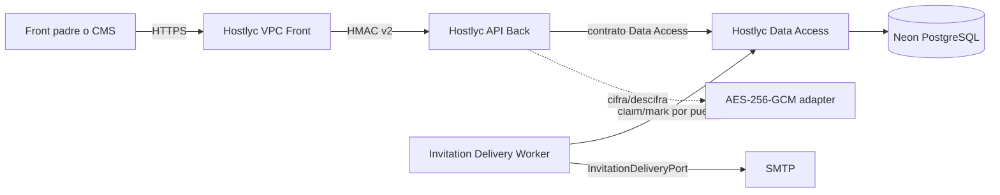
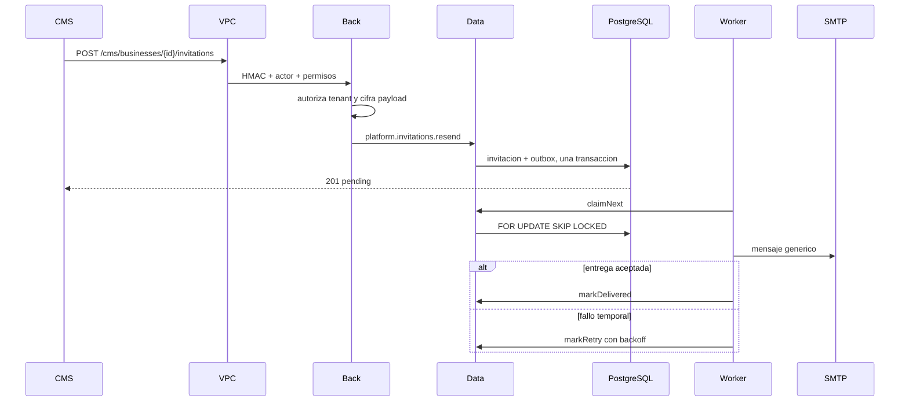
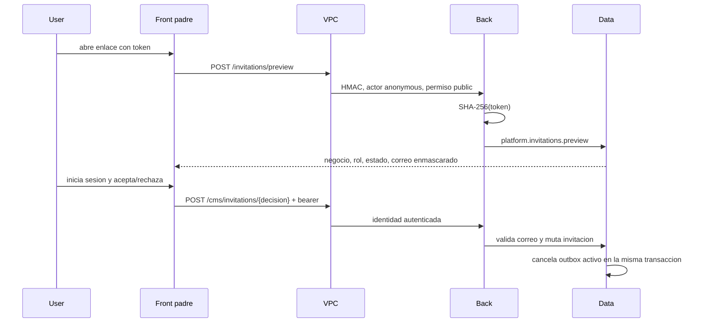

# Arquitectura de invitaciones y outbox

Fecha: 2026-07-27

## Decisiones

- El navegador y el CMS llaman unicamente a VPC Front.
- API Back conserva casos de uso y puertos; no ejecuta SQL.
- Data Access acepta solamente query keys allowlisted.
- El correo es generico y no contiene negocio, rol ni destinatario.
- El front obtiene el contexto por `POST /invitations/preview`.
- El payload del correo se cifra con AES-256-GCM antes de persistirse.
- PostgreSQL es el outbox durable. Redis queda fuera de este sprint.
- La entrega es al menos una vez y usa un `messageId` determinista.

## Componentes

## Crear y entregar

## Consultar y canjear

## Estados

Outbox: `pending`, `processing`, `delivered`, `dead`, `cancelled`.

Invitacion: `pending`, `accepted`, `rejected`, `revoked`; `expired` se calcula
contra `expiresAt` sin reescribir el registro durante una consulta.
